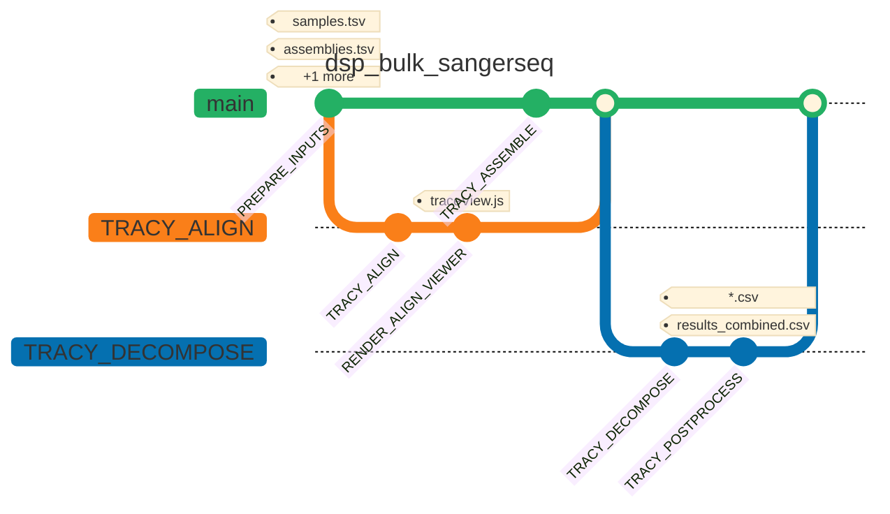

# Prototype Sanger sequencing tool for bulk analysis

## Background
Sanger sequencing ([Sanger *et al.*, 1977](https://doi.org/10.1073/pnas.74.12.5463)) remains an important approach for targeted DNA sequencing in molecular biology. With the increase of throughput in biological experimentation like in microbial genome engineering campaigns in industrial biotechnology, the manual evaluation of Sanger sequencing results becomes a very time-consuming task.
This **Bulk Sanger Sequencing Tool** was developed to reduce this time investment while maintaining a high quality of results evaluation. The tool uses established software that is specifically arranged to handle Sanger sequencing data in bulk. At its core, [Tracy](https://github.com/gear-genomics/tracy), [Sage](https://github.com/gear-genomics/sage) and [Indigo](https://github.com/gear-genomics/indigo) are used for the analysis and visualisation of Sanger sequencing data ([Rausch *et al.*, 2020](https://doi.org/10.1186/s12864-020-6635-8)). An analysis report is generated automatically with [VueGen](https://github.com/Multiomics-Analytics-Group/vuegen) ([Ayala-Ruano *et al.*, 2025](https://doi.org/10.1093/bioadv/vbaf149))

## Applicability of the dsp_bulk_sangerseq tool
Using this prototype tool, Sanger sequencing results with one or multiple sequencing files can be analysed. This can be either forward or reverse sequencing. For reverse sequencing, the reference sequence is automatically reverse-complemented by tracy without the need of manual intervention (in the alignment file output, the fasta header of the reference sequence indicates if it was used in forward direction or reverse-complemented for the alignment).
Combined analyses by assembling forward and reverse sequencing results is possible. A summary of all tracy functionalities can be found [here](https://www.gear-genomics.com/docs/tracy/cli/).
Currently, the tool supports only sequential analysis of multiple Sanger sequencing samples.

## Installing required software
Installation instructions are specifically described for Linux users.
Windows users should first install ```Windows Subsystem for Linux (WSL)``` and ```git``` on their system. Installing a code editor like ```VS Code``` is optional but recommended. For installation details for the above, see this [description](docs/installation_prerequisites.md).

All the following steps assume you have Ubuntu-24.04 (noble) installed. Certain installation details might be different on other Ubuntu releases.

### Install Python 3.12
Update the ```apt-get``` package manager using the following command:

```
sudo apt-get update
```

The bulk-sangerseq tool requires python version 3.12 (most tests were performed using python patch release 3.12.12). Install python 3.12 using the following command. More details can be found [here](https://docs.python-guide.org/starting/install3/linux/).

```
sudo apt-get install python3.12
```

### Install pipenv
Pipenv is a virtual environment management tool that can be installed using the following commands. Further details can be found [here](https://pypi.org/project/pipenv/).
Install ```pipx``` first:
```
sudo apt-get install pipx
pipx ensurepath
```
Install ```pipenv``` via ```pipx``` using command
```
pipx install pipenv
```
**IMPORTANT: Close the terminal and open a new terminal. The changes to your PATH to use ```pipenv``` take only effect when a new terminal session is started.**

### Install Docker
The tool makes use of Docker images for containerization of software applications. Follow the [installation instructions](https://docs.docker.com/engine/install/ubuntu/).


## Cloning the dsp_bulk_sangerseq repository from GitHub
Open the terminal and perform the following steps consecutively:

1. Change to the desired directory using ```cd </absolute/path/to/project/folder>```.

2. Clone the github repository:
To clone the latest version of the repository, use
```
git clone https://github.com/biosustain/dsp_bulk-sangerseq.git
```
If a specific release version of the code is intended to be used, use the below commands consecutively from within the local code repository ```dsp_bulk-sangerseq```.
```
git pull
```
and
```
git checkout <release-tag>
```
Replace <release-tag> by the desired release tag, e.g. ```v1```.

3. Change to the project directory using
```
cd dsp_bulk-sangerseq/
```

4. Install all dependencies from the Pipfile.lock using
```
pipenv sync
```

## Using the dsp_bulk_sangerseq tool

### Prepare data and a samplesheet
The tool requires Sanger sequencing (.ab1) and reference files stored in a multifasta file (.fa) files.

Deposit all .ab1 files and the multifasta file into the folder **data**.

Prepare a **samplesheet** according to the template below and save it as .csv file. It is recommended to deposit the samplesheet.csv in the **data** folder. Here you can also find three templates in subfolder ```data/test_data_1```. The tool will read the samplesheet file automatically after specifying the path to it in the ```config.yaml``` file (see instructions below).
**Note**:
The tool analyses samples that were sequenced in either forward or reverse direction. Reverse sequencing is **automatically** detected by the tracy software, *i.e.* any input sequences do **not** need to be reverse-complemented prior to analysis. The output files will indicate if reverse-complementation was performed.

In the ```sample_id``` column, fill in the sample names. In the ```ab1_file``` column, fill in the name of the sequencing file including the .ab1 file extension.
The tool uses references stored in a multifasta file. Fill the ```reference_id``` column with reference names which **must be the fasta header in the provided multifasta file**.

The ```assembly_group``` column is used for sequence assembly, e.g. assembling DNA sequencing from forward and reverse sequencing of a gene of interest. A minimum of two sequences can be assembled, however, assembling more sequences is possible. Currently, only reference-guided assembly is implemented, *i.e.* a reference file must be provided. In the ```assembly_group```column the user has to specify which sequences should be assembled. This is done here using a ```1``` or ```2```. In the example below, samples_3 and sample_4 (assembly_group 1) will be assembled using reference_C whereas sample_5 and sample_6 (assembly_group 2) will be assembled separately using reference_D.
If no assmebly of samples is desired, the fields in the ```assembly_group``` column have to be left blank (see sample_1 and sample_2 in below example).

| sample_id       | ab1_file     | assembly_group  | reference_id  |
|-----------------|--------------|-----------------|---------------|
| sample_name_1   | file_1.ab1   |                 | reference_A   |
| sample_name_2   | file_2.ab1   |                 | reference_B   |
| sample_name_3   | file_3.ab1   | 1               | reference_C   |
| sample_name_4   | file_4.ab1   | 1               | reference_C   |
| sample_name_5   | file_5.ab1   | 2               | reference_D   |
| sample_name_6   | file_6.ab1   | 2               | reference_D   |

### Modify the configuration file (config.yaml)
Change the following **variables to update the paths**. In general, the use of absolute paths is recommmended but relative paths can be used too.

```data_host``` (dtype: string): relative or absolute path to the data directory on your computer.
```outdir_host``` (dtype: string): relative or absolute path to the outdir directory on your computer. Default is ```./outdir```.
```samplesheet``` (dtype: string): relative or absolute path to the samplesheet on your computer.
```reference_fasta``` (dtype: string): relative or absolute path to the multi-fasta reference file on your computer.


Change the following **variables to update tracy trimming parameters**.

Trimming of sequences can be adjusted using hardcoded values.
```trim_left``` (dtype: integer): number of DNA bases to trim at the 5'-end. Default is ```50```.
```trim_right``` (dtype: integer): number of DNA bases to trim at the 3'-end. Default is ```50```.

Trimming stringency can be used in combination with ```trim_left``` and ```trim_right``` to determine sequence trimming length automatically based on the sequencing quality.  Trimming stringency ranges from 1:9 with 1 being the lowest and 9 the highest stringency, 0: disable.
Trimming stringency is handled separately for each of he tracy commands ```decompose```, ```align``` and ```assemble```.
Note, that for standard analyses workflows, trimming stringency for ```decompose``` and ```align``` should be identical values.

```trimming_stringency_decompose``` (dtype: integer): Default is ```0```.
```trimming_stringency_align``` (dtype: integer): Default is ```0```.
```trimming_stringency_assemble``` (dtype: integer): Default is ```4```.

**Note**, that other ```tracy``` command line parameters are not accessible yet which will be implemented in future.


Change the following **variable to update the vuegen report type**.

```report_type```(dtype: string): Default is ```streamlit```

The type of vuegen report can be chosen:
-  ```streamlit```. An interactive report is generated using the streamlit app. The report opens up automatically in an internet browser window after the analysis run is completed. **Note,** that for WSL users this doesn't work yet but a fix is underway.
    - After closing the streamlit app report, it can be generated again by running ```python3 -m bin.vuegen_report``` from the root of the directory (activate the virtual environment before using ```pipenv shell```)
- ```html```. The report is saved as html file.
- ```pdf```. The report is saved as pdf file.
    - For the ```pdf``` report type, it is required to install ```tinytex```. System-wide installation is achieved using command ```quarto install tinytex```
- Further vuegen report types can be found in the [vuegen documentation](https://github.com/Multiomics-Analytics-Group/vuegen).


### Run the dsp_bulk_sangerseq tool

If you use VS code, open the Ubuntu terminal, ```cd``` into the project directory and open VS code from the direcory using command
```
code .
```
Make sure VS code is connected to WSL by selecting ```Connect to WSL``` from the bottom left button in VS Code. If connected, ```WSL:Ubuntu-24.04``` should be displayed.


Perform the following steps consecutively.

0. Add user to the docker group (only required once)
Sequence analysis using ```tracy``` is done in Docker containers. To execute python scripts without ```sudo``` preceeding commands (which can lead to other issues like accessed python installation), add your user to the docker group using command
```
sudo usermod -aG docker $USER
```
**IMPORTANT: Close the terminal and open a new one to let the change take effect.**

1. Start the Docker daemon
To use the tool, the Docker daemon has to be started using the following command (here ```sudo``` preceeding the command is still required). Further information can be found in the [docker documentation](https://docs.docker.com/engine/daemon/start/).

```
sudo systemctl start docker
```

2. In the project directory, activate the virtual environment using command
```
pipenv shell
```

3. Perform Sanger sequencing analysis using command
```
bash main.sh
```

Once the analysis is completed, the streamlit report should open automatically in a browser window (if ```streamlit``` was selected as the report type). For WSL users, opening the report automatically might not work or might be delayed. If his is observed, hit ```Enter``` to open it.

## Output of the tool

### Structure of the output directory
```
outdir
├── align
├── assemble
├── decompose
├── results_combined.csv
├── sample_1.csv
├── sample_2.csv
└── vuegen_report
```
- ```align```: directory with results from the ```tracy align``` process  (sequence alignment of Sanger sequencing result against a reference)
- ```assemble```: directory with results from the ```tracy assemble``` process (reference-guided asssembly of overlapping DNA sequences)
-  ```decompose```: directory with results from the ```tracy decompose``` process (detection of mutations and decomposition of double-peaks)
- ```sample_1.csv``` and ```sample_2.csv```: mutation detection results from ```tracy decompose``` process per sample
- ```results_combined.csv```: consolidated mutation detection results from all samples (here ```sample_1.csv``` and ```sample_2.csv```)

#### Structure of the ```align``` subdirectory
```
outdir/align
├── sample_1.abif
├── sample_1.align.fa
├── sample_1.html
├── sample_1.json
├── sample_1.txt
├── sample_2.abif
├── sample_2.align.fa
├── sample_2.html
├── sample_2.json
└── sample_2.txt
```

- ```.align.fa```: pairwise sequence alignment file (Sanger sequencing result against reference sequence)
- ```.txt```: pairwise sequence alignment (Sanger sequencing result against reference sequence)
- ```.html```: visualisation of Sanger sequencing result using ```Sage```
- ```.json```: all output from ```tracy align```process

#### Structure of the ```decompose``` subdirectory
```
outdir/decompose
├── sample_1.abif
├── sample_1.align1
├── sample_1.align2
├── sample_1.align3
├── sample_1.bcf
├── sample_1.bcf.csi
├── sample_1.decomp
├── sample_1.html
├── sample_1.json
├── sample_2.abif
├── sample_2.align1
├── sample_2.align2
├── sample_2.align3
├── sample_2.bcf
├── sample_2.bcf.csi
├── sample_2.decomp
├── sample_2.html
└── sample_2.json
```
- ```.align1.fa```: pairwise sequence alignment file of main signal against reference sequence
- ```.align2.fa```: pairwise sequence alignment file of minor signal against reference sequence
- ```.align3.fa```: pairwise sequence alignment file of major against minor signal
- ```.html```: visualisation of Sanger sequeencing result using ```Indigo```
- ```.bcf```: binary call format file; binary version of the variant calling file (VCF); can be converted to VCF using [bcftools](https://github.com/samtools/bcftools)
- ```.json```: all output from ```tracy decompose``` process

#### Structure of the ```assemble``` subdirectory
```
outdir/assemble
├── sample_1_sample_2.align.fa
├── sample_1_sample_2.cons.fa
├── sample_1_sample_2.html
├── sample_1_sample_2.json
└── sample_1_sample_2.vertical
```
- ```.align.fa```: multiple sequence alignment file of Sanger sequencing results against the reference sequence --> can be visualised using the
webtool [Sabre](https://www.gear-genomics.com/sabre/)
- ```.cons.fa```: consensus sequence generated from ```tracy assemble```
- ```.html``` (NOT IMPLEMENTED YET): visualisation of Sanger sequencing assembly result using ```Pearl```
- ```.json```: all output from ```tracy assemble``` process

#### Structure of the ```vuegen_report``` subdirectory
```
outdir/vuegen_report
├── 01_Mutation_tables_decompose
│   └── results_combined.csv
├── 02_alignments_decompose
│   ├── align1
│   │   ├── sample_1.align1.md
│   │   └── sample_2.align1.md
│   ├── align2
│   │   ├── sample_1.align2.md
│   │   └── sample_2.align2.md
│   └── align3
│       ├── sample_1.align3.md
│       └── sample_2.align3.md
├── 03_alignments_align
│   ├── sample_1.txt.md
│   └── sample_2.txt.md
└── 04_sequence_assembly_assemble
    ├── alignments
    │   └── sample_1_sample_2.align.fa.md
    └── consensus_sequences
        └── sample_1_sample_2.cons.fa.md
```

## Run the workflow with Nextflow

The repository also contains a Nextflow pipeline that mirrors the current samplesheet-driven Tracy workflow.

```bash
nextflow run . -profile docker,test
```

Common parameter overrides:

```bash
nextflow run . -profile docker \
  --data_dir data/test_data_1 \
  --samplesheet data/test_data_1/samplesheet_test_data_1_multi_ref_grouping_9samples.csv \
  --reference_fasta data/test_data_1/references.fa \
  --outdir outdir
```

### Pipeline diagram

<!-- The diagram below was generated with [nf-mapper](https://github.com/Skitionek/nf-mapper), which converts the Nextflow pipeline into a Mermaid `gitGraph`: the longest processing path forms the `main` branch, parallel operations fork off into separate branches, and each process (commit) is tagged with the output file patterns it produces. Regenerate it with:

```bash
docker run --rm -v "$(pwd):/data" ghcr.io/skitionek/nf-mapper:main \
  --title "dsp_bulk_sangerseq" --format md /data/workflows/dsp_bulk_sangerseq.nf
``` -->



### Testing the Nextflow pipeline

The pipeline is covered by [nf-test](https://www.nf-test.com). Tests run against the small dataset in `data/test_data_1` using the `docker,test` profile, so **Docker must be running** (the `geargenomics/tracy` and `python:3.12` images are pulled automatically).

Install nf-test once (it is git-ignored and not committed):

```bash
curl -fsSL https://get.nf-test.com | bash
```

Run the full suite, or a single test file:

```bash
./nf-test test
./nf-test test modules/local/tracy/align/tests/main.nf.test
```

The suite consists of:

| Test | Scope |
| --- | --- |
| `tests/default.nf.test` | End-to-end pipeline run on the test dataset |
| `workflows/tests/dsp_bulk_sangerseq.nf.test` | `DSP_BULK_SANGERSEQ` workflow, including input-validation failure cases |
| `modules/local/prepare/inputs/tests/main.nf.test` | `PREPARE_INPUTS` |
| `modules/local/tracy/{align,decompose,assemble}/tests/main.nf.test` | `TRACY_ALIGN`, `TRACY_DECOMPOSE`, `TRACY_ASSEMBLE` |
| `modules/local/utils/{copy_trace_js,render_align_viewer}/tests/main.nf.test` | `COPY_TRACE_JS`, `RENDER_ALIGN_VIEWER` |

Test configuration lives in `nf-test.config` (profiles, work dir) and `tests/nextflow.config`; the test dataset paths are defined once in `conf/test.config`.
